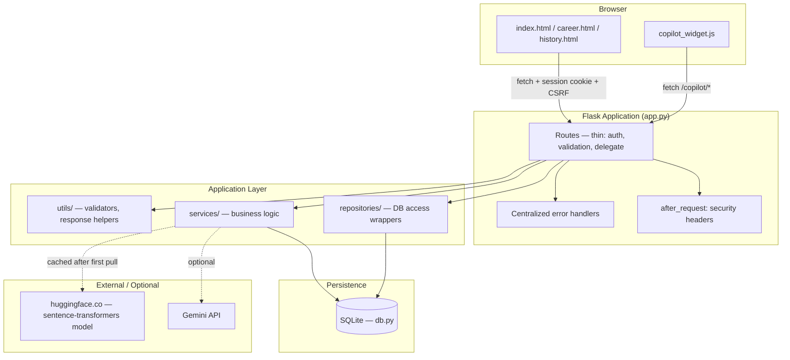
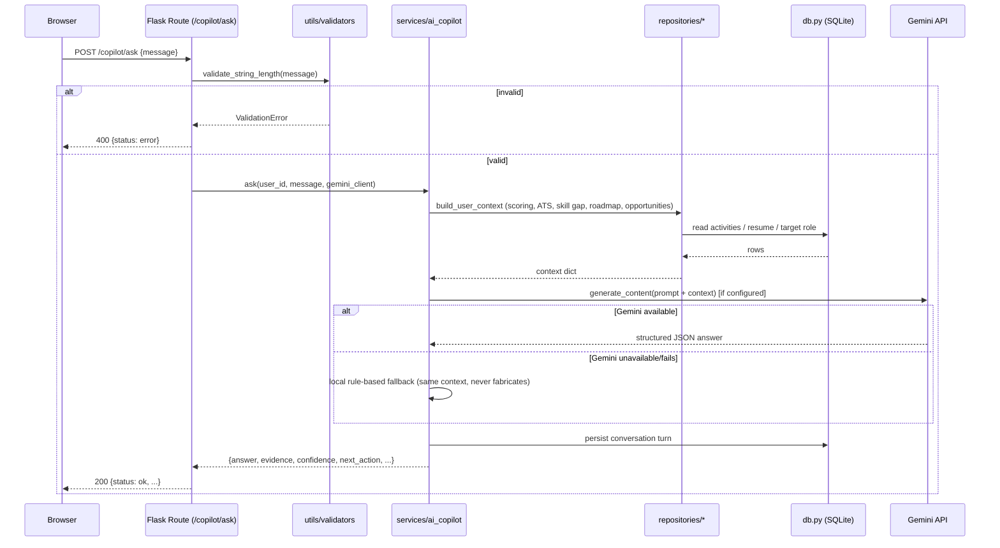
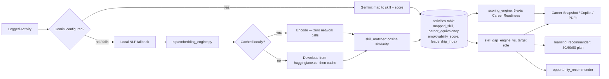
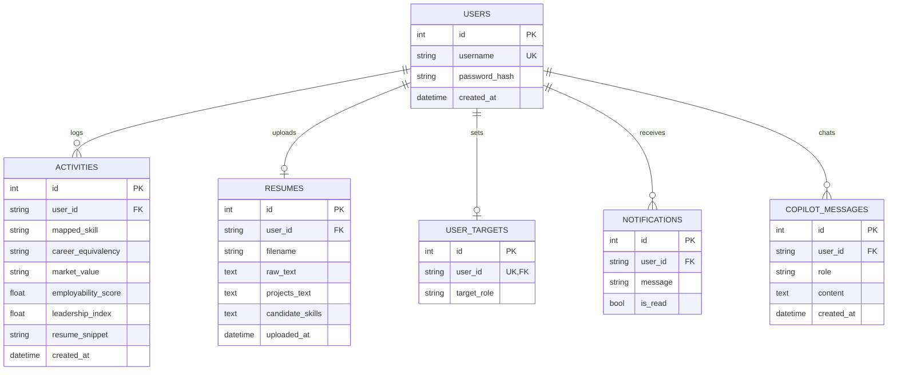
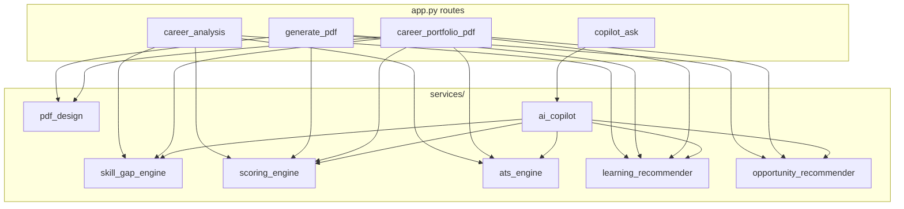
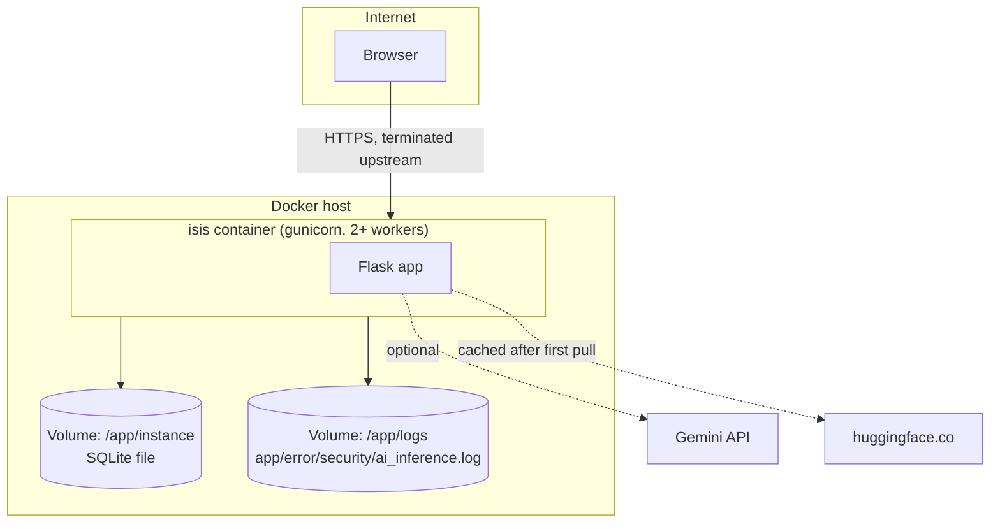

# Architecture

## System Architecture

## Request Flow (example: AI Copilot)

## AI Pipeline

## Database Interactions (ERD)

## Service Layer

## Deployment Architecture

Note: this diagram assumes a reverse proxy (nginx/Caddy/a cloud load
balancer) in front of the container for TLS termination — the container
itself serves plain HTTP on port 5000. `SESSION_COOKIE_SECURE=true` should
only be set once that HTTPS termination is actually in place.

---

## Key Design Decisions & Scope Boundaries

This section is deliberately explicit about what was **not** done and why —
see also [docs/AUDIT.md](AUDIT.md) for the full production-readiness audit.

### Database: SQLite kept, full Postgres/SQLAlchemy migration not done

Rewriting `db.py`'s ~30 functions (raw `sqlite3`) onto SQLAlchemy to support
both SQLite and Postgres would touch the single most business-critical,
already-working file in the app, with no automated migration-correctness
net beyond the test suite added in this pass. Given the brief's own top
priority — preserve all functionality — this was judged too high-risk to
do as a blind rewrite in one pass. Instead:
- `config.py`'s `DATABASE_URL` is already wired up for a future SQLAlchemy
  implementation to read.
- `db.DB_PATH` now respects `ISIS_DB_PATH` (previously hardcoded), which is
  what actually makes the Docker volume / backup script work today.
- Indexes were added on every `user_id` column (the actual hot path).
- `scripts/backup_db.py` and `scripts/seed_db.py` cover the "backup
  strategy" and "seed scripts" asks without needing the ORM migration.

### Repository pattern: added, not retrofitted onto all ~80 call sites

`repositories/` wraps `db.py` behind clean interfaces. `set_target_role`
and the Copilot routes were migrated to prove the pattern end-to-end and
are fully covered by tests. The remaining ~75 `db.*` call sites across
`app.py` were **not** all migrated — that's a mechanical but large-diff
change across a 2,300-line file, and the value (nicer call sites) doesn't
justify the regression surface for a file with no other correctness net
beyond manual testing before this pass. Recommended as the pattern for all
new routes going forward.

### Auth: hardened session auth kept; JWT/RBAC not bolted on

The existing Flask-Login session auth was already solid (CSRF everywhere,
`HttpOnly`/`SameSite` cookies, password hashing, rate limiting). Replacing
it with JWT would mean rewriting every `@login_required` route and the
frontend's fetch calls, for an app that has exactly one user role and no
multi-service/mobile-client need for stateless tokens today. That's a
large, purely speculative rewrite with real regression risk and no proven
requirement driving it — skipped. Security headers (Task 6's other ask)
*were* added, since that's genuinely additive and zero-risk.

### Code quality: new modules formatted, legacy files left as-is

`black`/`flake8` are configured and pass cleanly on every module added in
this pass. The pre-existing `app.py`/`db.py`/`services/*.py` (207
pre-existing style violations, mostly spacing/blank-lines) were **not**
mass-reformatted — a repo-wide `black` run on files with real business
logic and no line-by-line review budget is exactly the kind of change the
brief's "do not change business logic unless necessary" warns against,
even though formatting is nominally behavior-preserving.
